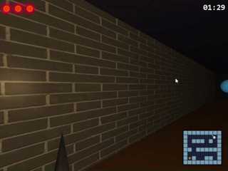
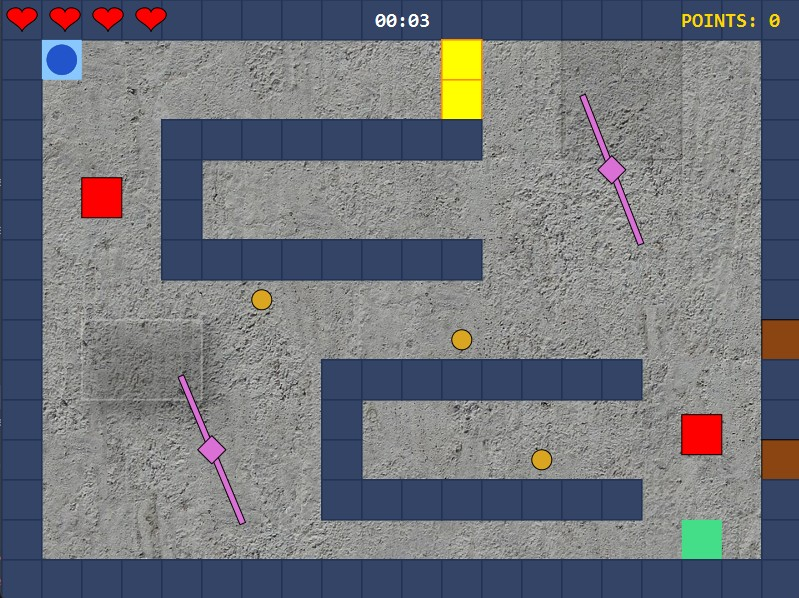
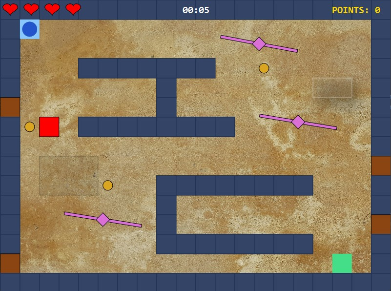
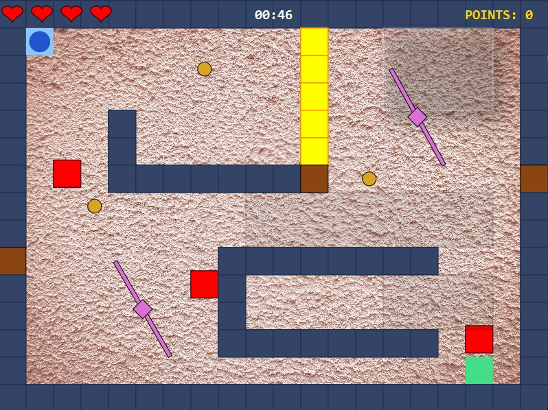
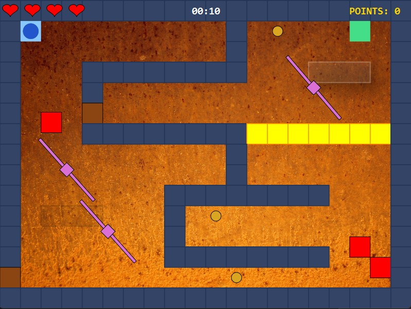

# 🎮 Escape the Dungeon

A single-player 3D game developed in **Java and JavaFX**, focused on first-person navigation, collision detection, animated hazards, interactive game objects and dynamic gameplay effects.

<p align="center">
  
</p>

The goal is to navigate through the dungeon, avoid guards and obstacles, unlock blocked passages and find the exit before losing all health points.

---

## 🎥 Gameplay

The player explores the dungeon from a first-person perspective and can move forward and backward while rotating left and right.

Before starting the game, the player can choose between several dungeons, each with a different layout and obstacle configuration.

Some passages are blocked by doors that can only be opened by activating the corresponding switches. Guards patrol predefined routes throughout the dungeon, while temporary power-ups and negative effects can significantly change the gameplay.

---

## 🚀 Quick Start

A pre-built version of the game is available in the
[latest GitHub Release](https://github.com/minaOstojic1000/3D-Game-Dungeon-Runner/releases/latest).

### 🪟 Option 1: Windows — no Java required

For the easiest setup, download `EscapeTheDungeon-Windows.zip`.

1. Extract the archive.
2. Open the extracted folder and run `bin\EscapeTheDungeon.bat`.

No separate Java installation is required.

### ☕ Option 2: JAR

If you already have Java installed, download `EscapeTheDungeon.jar` from the latest release, open a terminal in the directory containing the file, and run:

```bash
java -jar EscapeTheDungeon.jar
```

#### Requirements

- **Java 17 or later** must be installed.
- The `java` command must be available from the system terminal.

You can verify your Java installation with:

```bash
java -version
```

---

## ✨ Features

- First-person 3D movement and rotation
- Multiple selectable dungeons with different layouts
- Collision detection with walls and game objects
- Animated obstacles and hazards
- Patrolling guards following predefined routes
- Health system with randomly appearing heart pickups
- Locked doors controlled by corresponding switches
- Temporary shield power-up that protects the player from guards and obstacles
- Visual shield effect while protection is active
- Negative potions that temporarily invert movement and rotation controls
- Randomized placement and spawning of interactive objects
- Game-state tracking for health and elapsed time

---

## 🏰 Dungeons

The game contains multiple dungeon layouts with different wall configurations, obstacles and gameplay challenges.

<p align="center">
  
  
</p>

<p align="center">
  
  
</p>

---

## ⚙️ Implementation Highlights

Some of the main systems implemented in the project include:

- First-person camera movement and rotation
- Player collision detection within a 3D environment
- Animated and moving game obstacles
- Patrol movement for guards
- Trigger-based interaction between switches and doors
- Timed and randomly spawned power-ups
- Temporary player-state effects such as shield protection and inverted controls
- Projectile and moving-hazard collision handling
- Dynamic lighting and visual effects
- Custom textured 3D objects and meshes
- Multiple configurable dungeon layouts
- Game-state tracking for health and elapsed time

---

## 🛠️ Technologies

- **Java**
- **JavaFX**
- **Maven**

---

## ▶️ Running from Source

### Requirements

- JDK 17 or later
- If you run the game using the Maven Wrapper command below, make sure the `JAVA_HOME` environment variable is defined and points to the root directory of your installed JDK, not to its `bin` directory.

### Using Maven Wrapper

From the **root directory of the project**, run:

#### On Windows:

```powershell
.\mvnw.cmd clean javafx:run
```

#### On Linux/macOS:

```bash
./mvnw clean javafx:run
```

Alternatively, the project can be opened and run directly from an IDE with JavaFX support.

---

## 🎓 Project Context

This project was developed as part of the **Computer Graphics** course at the **School of Electrical Engineering, University of Belgrade**.

The assignment focused on the development of a 3D single-player game using JavaFX and the implementation of interactive 3D graphics, movement, animation and collision-based game mechanics.

---

## 👩‍💻 Author

**Mina Ostojić**

GitHub: [@minaOstojic1000](https://github.com/minaOstojic1000)
